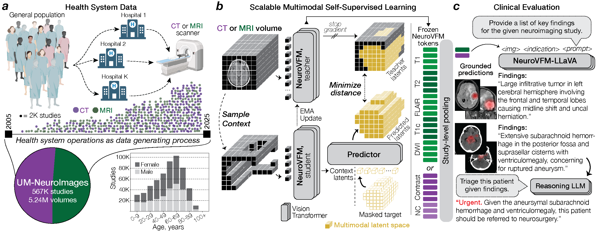

# NeuroVFM

## Health system learning achieves generalist neuroimaging models

[**Preprint**](https://arxiv.org/abs/2511.18640) / [**Interactive Demo**](https://neurovfm.mlins.org) / [**Models**](https://huggingface.co/collections/mlinslab/neurovfm) / [**MLiNS Lab**](https://mlins.org)

**NeuroVFM** is a health system–scale, volumetric foundation model for multimodal neuroimaging, trained with self-supervision on **5.24M** MRI/CT volumes (**567k** studies) spanning **20+ years** of routine clinical care at Michigan Medicine. 



The NeuroVFM stack includes:

- **3D ViT encoder**, general-purpose representations for *any* clinical neuroimage (T1, T2, FLAIR, DWI, CT, etc.)
- **Study-level diagnostic heads**, covering **74 MRI**/**82 CT** expert-defined diagnoses for *any* neuroimaging study
- **Findings LLM**, generates preliminary findings given *any* neuroimaging study plus clinical context
- **Reasoning API**, pass outputs to a frontier reasoning model for higher-level tasks (e.g., triage)

> **Research use only.** Not a medical device. Do not use for clinical decision-making.

## 🔎 TL;DR (what NeuroVFM gives you)

NeuroVFM's defining feature is a standalone `pipelines/` package, which processes raw NIfTI/DICOM files given a study directory and returns (1) diagnostic probabilities, (2) findings, and (3) interpretation from a frontier reasoning model. All NeuroVFM models are hosted on HuggingFace; please request access [here](https://huggingface.co/collections/mlinslab/neurovfm).

```python
from neurovfm.pipelines import load_encoder, load_diagnostic_head, load_vlm, interpret_findings

# Load pretrained models from HuggingFace
encoder, preprocessor = load_encoder("mlinslab/neurovfm-encoder")
dx_head = load_diagnostic_head("mlinslab/neurovfm-dx-ct")

# Load and preprocess a study directory with 1+ DICOM/NIfTI files
batch = preprocessor.load_study("/path/to/ct/study/", modality="ct")

# Generate embeddings and predictions
embeddings = encoder.embed(batch)
predictions = dx_head.predict(embeddings, batch)

# Load findings LLM
generator, preproc = load_vlm("mlinslab/neurovfm-llm")
vols = preproc.load_study("/path/to/study/")

# clinical_context = "LOC and nausea."                  # optional clinical context
clinical_context = None

findings = generator.generate(vols, clinical_context)

# optional: pass findings to external frontier LLM to interpret (e.g. clinical triage)
api_key = "..." # requires API key (e.g., OpenAI) set in your environment
intepretation = interpret_findings(findings, clinical_context, api_key)
```

## Installation

NeuroVFM is a standard Python package built on PyTorch. To install it, clone this repository and install with `pip` (editable or regular). For efficient 3D ViT training and inference, NeuroVFM expects **FlashAttention-2 v2.6.3** built from source (including the fused dense/MLP and DropAddNorm kernels). FlashAttention-2 only supports recent NVIDIA GPUs with Tensor Cores; see the `flash-attn` README for exact GPU, CUDA, and PyTorch compatibility.

## Training

Code to reproduce the main experiments in our manuscript are provided under `training/`. We provide a cached dataset feature that allows users to initially preprocess their data using our pipeline and save them as `.pt` files for faster subsequent training. For more information, see `training/README.md.`

## LICENSE

Code is released under the MIT License. Model weights are provided under the CC-BY-NC-SA 4.0 LICENSE on HuggingFace; please request access with your institutional email.

